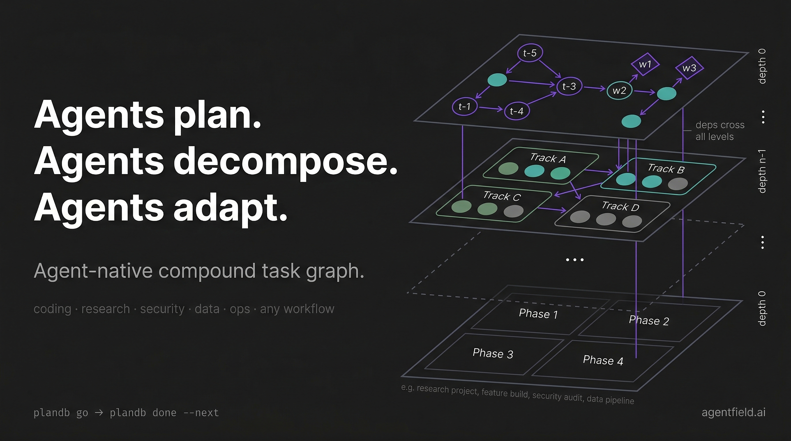

<div align="center">



# PlanDB

### **Agent-native compound task graph.**

*Agents plan, decompose, parallelize, and adapt — autonomously.*

[](https://github.com/Agent-Field/plandb/stargazers)
[](LICENSE)
[](https://github.com/Agent-Field/plandb/commits/main)

**[Architecture](docs/ARCHITECTURE.md)** · **[Agent Prompt](#copy-paste-prompt-for-your-agent)** · **[Examples](examples/)** · **[CLI Reference](#cli-reference)**

</div>

---

A single binary. Zero infrastructure. PlanDB gives AI agents a compound task graph — recursive hierarchy with cross-level dependencies — so they can decompose complex work, parallelize safely, and adapt plans mid-flight. The graph structure itself is the scheduling algorithm: `ready` = run now, `pending` = blocked, multiple `ready` = parallelize.

## Why PlanDB

| Without PlanDB | With PlanDB |
|---|---|
| Agent works sequentially, loses track | Dependency graph enforces ordering |
| Parallel agents step on each other | Atomic claiming prevents double-assignment |
| Plans are rigid — break on contact with reality | Split, insert, pivot, replan mid-flight |
| Flat task lists, no structure | Compound graph: recursive hierarchy + cross-level deps |
| Quality is "hope the agent checks" | Pre/post conditions make expectations explicit |
| No visibility into what's blocking what | Critical path, bottlenecks, what-unlocks queries |

## Install

```bash
# macOS / Linux
curl -fsSL https://github.com/Agent-Field/plandb/releases/latest/download/plandb-$(uname -s | tr '[:upper:]' '[:lower:]')-$(uname -m) -o /usr/local/bin/plandb && chmod +x /usr/local/bin/plandb

# From source
cargo install --path .
```

## 30-Second Demo

```bash
plandb init "my-project"
plandb add "Design the API" --as design --description "Define REST endpoints and auth strategy"
plandb add "Build backend" --dep t-design --description "Implement the API spec"
plandb add "Write tests" --dep t-design --description "Integration tests for all endpoints"
plandb go                    # claim next ready task
# ... work ...
plandb done --next           # complete + claim next (no ID needed)
```

## Copy-Paste Prompt for Your Agent

Generate a ready-to-use system prompt for any AI agent:

```bash
plandb prompt --for cli    # system prompt for CLI agents (Codex, Claude Code, Gemini, Aider)
plandb prompt --for mcp    # MCP config JSON for Claude Code / Cursor / Windsurf
plandb prompt --for http   # REST API instructions for custom agents
```

Or copy this minimal prompt into your agent's instructions:

```
You have plandb installed for task planning. Use it to decompose work and track progress.

Core loop:    plandb go → work → plandb done --next
Add tasks:    plandb add "title" --description "detailed spec" --dep t-xxx
Split:        plandb split --into "A, B, C" (independent) or "A > B > C" (chain)
Introspect:   plandb critical-path | plandb bottlenecks | plandb what-unlocks <id>
Status:       plandb status --detail

After each completion, reassess: plandb status --detail + plandb critical-path.
Plans are hypotheses — adapt as you learn.
When plandb list --status ready shows multiple tasks, parallelize them.
```

See [examples/](examples/) for complete scripts running PlanDB with Codex, Claude Code, and Gemini CLI.

## What Makes It Different

### Compound Graph

Two orthogonal structures composed together — more general than a DAG, hierarchical DAG, or hypergraph:

- **Place graph** (containment): tasks contain subtasks recursively, to any depth
- **Link graph** (dependencies): edges between tasks at ANY level, crossing containment boundaries

A subtask at depth 3 can depend on a task at depth 0 in a different branch. Nesting doesn't constrain flow. Composite tasks auto-complete when all children finish.

### Zero-Friction Core Loop

```bash
plandb go          # claim next ready task (no --agent needed, no IDs)
plandb done --next # complete current + claim next
```

### Graph-Aware Intelligence

```bash
plandb critical-path       # what to prioritize — longest chain to completion
plandb bottlenecks         # what's blocking the most downstream work
plandb what-unlocks t-abc  # impact of completing a specific task
plandb watch               # live dashboard
```

### Quality Gates

```bash
plandb add "Implement API" \
  --pre "schema must define all endpoints" \
  --post "all routes return valid JSON" \
  --description "..."
```

### Reusable Decompositions

```bash
plandb export > fullstack.yaml    # save a successful project's structure
plandb import fullstack.yaml      # apply pattern to new project
```

## CLI Reference

### Task Lifecycle

```bash
plandb init "project"                                     # create project
plandb add "title" --description "spec" --dep t-xxx       # add task
plandb add "title" --as custom-id --kind code             # custom ID, typed
plandb go                                                  # claim next ready
plandb done --next                                         # complete + claim next
plandb done --result '{"key": "value"}'                   # complete with data
```

### Decomposition

```bash
plandb split --into "A, B, C"                              # independent subtasks
plandb split --into "A > B > C"                            # linear chain
plandb task decompose t-abc --file subtasks.yaml           # from YAML
plandb use t-abc                                           # scope into subtree
plandb use ..                                              # scope out
```

### Introspection

```bash
plandb status --detail                                     # dependency tree
plandb status --full                                       # compound graph view
plandb critical-path                                       # longest chain
plandb bottlenecks                                         # blocking tasks
plandb what-unlocks t-abc                                  # downstream impact
plandb watch                                               # live dashboard
```

### Plan Adaptation

```bash
plandb task insert --after t-a --before t-b --title "X"   # insert step
plandb task amend t-abc --prepend "NOTE: ..."              # annotate
plandb task pivot t-abc --file new-plan.yaml               # replace subtree
plandb what-if cancel t-abc                                # preview effects
plandb export > template.yaml                              # save pattern
plandb import template.yaml                                # apply pattern
```

### Multi-Agent

```bash
PLANDB_AGENT=w1 plandb go          # atomic claim (no double-assignment)
PLANDB_AGENT=w1 plandb done --next
```

### Constraints

- `--kind`: `generic`, `code`, `research`, `review`, `test`, `shell`
- `--dep`: upstream must exist first. Types: `feeds_into` (default), `blocks`, `suggests`
- `--description`: always include — it's the work order, not the title
- IDs: short (`t-k3m9`), custom (`--as api` → `t-api`), fuzzy-matched on typos

## Interfaces

| Interface | Command | Use Case |
|-----------|---------|----------|
| CLI | `plandb <command>` | Direct agent use |
| MCP | `plandb mcp` | Claude Code, Cursor, Windsurf |
| HTTP | `plandb serve --port 8484` | Custom agents, webhooks |

## Architecture

PlanDB uses a **compound graph** — see [docs/ARCHITECTURE.md](docs/ARCHITECTURE.md) for the full design: why two orthogonal structures, cross-level dependency mechanics, comparison with flat DAGs/hypergraphs, composite auto-completion, and when each structure matters.

## License

Apache License 2.0
